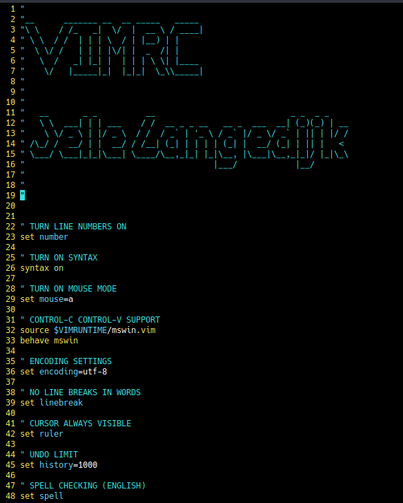

# Linux Configuration Files
## About this Repository
* This repository contains miscellaneous Linux files, like desktop entries and configuration files. These are the ones that I *currently* use on my Linux System.
## Hierarchy
#### i3
* Contains i3 and i3status config files.

#### images
* Contains the images used within this repository.

#### neofetch
* Contains a customised neofetch configuration file.
#### picom
* Contains the picom.conf configuration file.

#### .bashrc

* The .bashrc file is currently set-up for Solus, some aliases have to be edited manually to work with other distributions.

#### .vimrc

* The .vimrc file contains my current VIM setup.

#### marco.compton.conf
* Configuration File of Compton Compositor for the MATE-COMPIZ DE. Has to be placed into ~/.config

